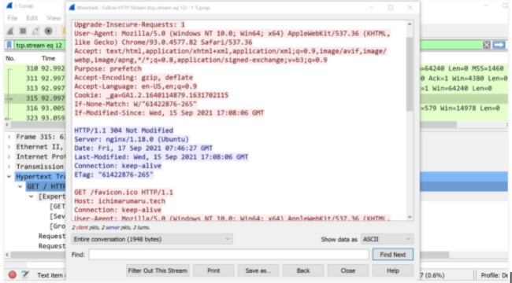
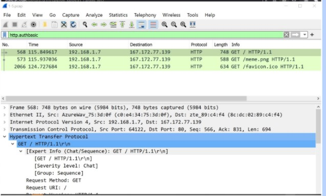
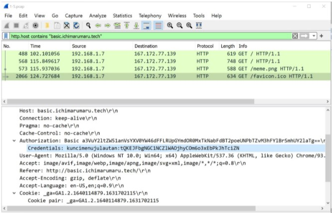
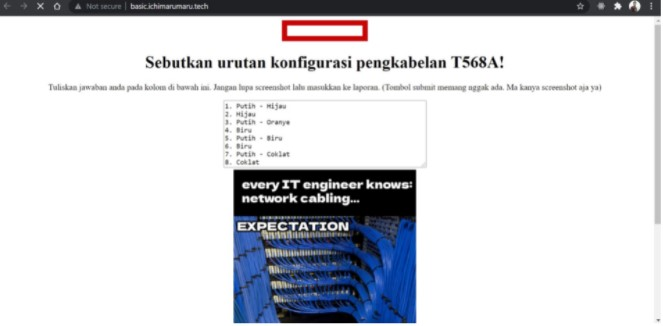
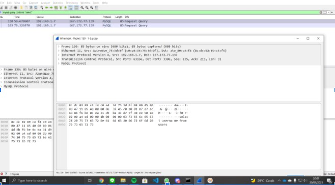
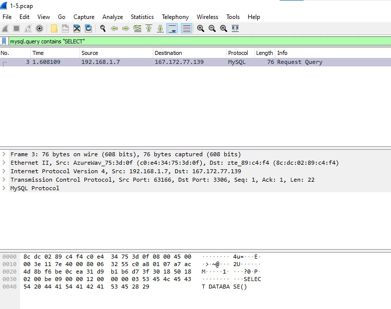
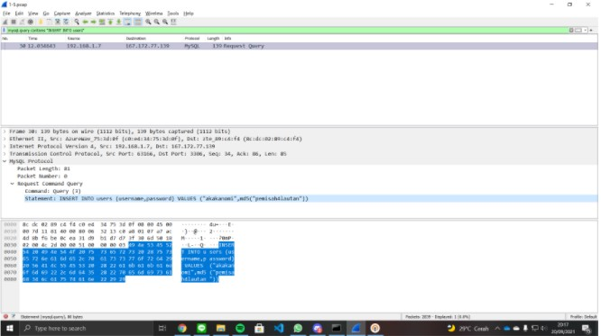
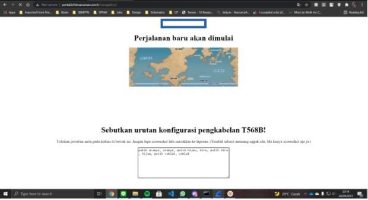

# Jarkom-Modul-1-C03-2021

- Junaedi Akbar 05111940000041
- Zydhan Linnar Putra 05111940000118
- M.Fajri Davyza Chaniago 05111940000180

## 1

> Sebutkan webserver yang digunakan pada "ichimarumaru.tech"!
> Untuk Menjalankan :

```
http.host == “ichimarumaru.tech”
```

Maka akan diperoleh hasil berikut
<br>

<br>

## 2

> Temukan paket dari web-web yang menggunakan basic authentication method!
> Untuk Menjalankan :

```
http.authbasic
```

Maka akan diperoleh hasil berikut
<br>

<br>

## 3

> Ikuti perintah di basic.ichimarumaru.tech! Username dan password bisa didapatkan dari file .pcapng!
> Gunakan perintah untuk mendapatkan kode dan pass

```
 http.host contains basic.ichimarumaru.tech
```

Maka akan diperoleh hasil berikut
<br>

<br>
Kode dan User name terletak pada bagian credentials .
<br>
Kemudian Berikut hasil dari web pencarian dengan menggunakan kode damn password yang di dapat
<br>

<br>

## 4

> Temukan paket mysql yang mengandung perintah query select!
> Untuk Menjalankan :
> Digunakan 'SELECT' dengan menggunakan huruf besar dan kecil

```
mysql.query contains "select"
```

```
mysql.query contains "SELECT"
```

Maka akan diperoleh hasil berikut
<br>


<br>

## 5

> Login ke portal.ichimarumaru.tech kemudian ikuti perintahnya! Username dan password bisa didapat dari query insert pada table users dari file .pcap!
> Untuk Menjalankan :

```
http.authbasic
```

Maka akan diperoleh hasil berikut
<br>

<br>
Kemudian Berikut hasil dari web pencarian dengan menggunakan kode damn password yang di dapat
<br>

<br>

## 6

> Cari username dan password ketika melakukan login ke FTP Server!

Menjalankan filter:

```
 ftp.request.command == USER || ftp.request.command == PASS
```

Maka akan diperoleh hasil berikut
<br>

<br>

## 7

> Ada 500 file zip yang disimpan ke FTP Server dengan nama 0.zip, 1.zip, 2.zip, ..., 499.zip. Simpan dan Buka file pdf tersebut. (Hint = nama pdf-nya "Real.pdf")

Menjalankan filter:

```
frame contains “Real.pdf”
```

Sehingga diperoleh hasil berikut:
<br>

<br>
Selanjutnya _Follow_ -> _TCP Stream_ dan download sebagai RAW
<br>

<br>
Berikut adalah file yang diperoleh:
<br>

<br>

## 8

> Cari paket yang menunjukan pengambilan file dari FTP tersebut!

Sehingga perlu mencari string RETR (untuk mengambil file)
Menjalankan filter:

```
ftp-data.command contains RETR
```

<br>


## 9

> Dari paket-paket yang menuju FTP terdapat inidkasi penyimpanan beberapa file. Salah satunya adalah sebuah file berisi data rahasia dengan nama "secret.zip". Simpan dan buka file tersebut!

Menjalankan filter:

```
ftp-data.command contains "secret.zip"
```

<br>

<br>
Diperoleh file `wanted.pdf` di dalam `secret.zip` namun masih memerlukan password untuk membukanya.

## 10

> Selain itu terdapat "history.txt" yang kemungkinan berisi history bash server tersebut! Gunakan isi dari "history.txt" untuk menemukan password untuk membuka file rahasia yang ada di "secret.zip"!

Menjalankan filter:

```
ftp-data.command contains "history.txt"
```

Untuk mencari file `history.txt`
<br>
Diperoleh:
<br>

<br>
Selanjutnya follow TCP Stream, diperoleh
<br>

<br>
ditemukan `key = "$(tail -1 bukanapaapa.txt)`
<br>
sehingga perlu mencari file **bukanapaapa.txt**, dengan filter:

```
ftp-data.command contains "bukanapaapa.txt"
```

Sehingga diperoleh:
<br>

<br>
diperoleh password : `d1b1langbukanapaapajugagapercaya`
<br>
Selanjutnya buka file `wanted.pdf` pada `secret.zip`
<br>

<br>

## 11

> Filter sehingga wireshark hanya mengambil paket yang berasal dari port 80!

Menjalankan filter:

```text
src port 80
```

Setelah itu untuk mendapatkan hasil di wireshark perlu dilakukan pembukaan website yang menggunakan http (port 80) seperti monta.if.its.ac.id.


## 12

> Filter sehingga wireshark hanya mengambil paket yang mengandung port 21!

Menjalankan filter:

```text
port 21
```

Setelah itu untuk mendapatkan hasil di wireshark perlu dilakukan curl ke web dengan protokol FTP (port 21) seperti [ftp://ftp.unicode.org/public/unidata/unicodedata.txt](ftp://ftp.unicode.org/public/unidata/unicodedata.txt).


## 13

> Filter sehingga wireshark hanya menampilkan paket yang menuju port 443!

Menjalankan filter:

```text
dst port 443
```

Kita tidak perlu membuka apapun karena banyak _background task_ sistem yang melakukan komunikasi ke port 443.


## 14

> Filter sehingga wireshark hanya mengambil paket yang tujuannya ke kemenag.go.id!

Menjalankan filter:

```text
dst host kemenag.go.id
```

Setelah membuka kemenag.go.id didapatkan hasil sebagai berikut.


## 15

> Filter sehingga wireshark hanya mengambil paket yang berasal dari ip kalian!

Menjalankan filter: (IP saya 192.168.1.2)

```text
src host 192.168.1.2
```

Kita tidak perlu membuka apapun karena banyak _background task_ sistem yang melakukan komunikasi ke server luar.


<hr>

## Kendala

Jaringan internet saat hari pengerjaan modul kurang mendukung sehingga kesulitan dalam mendownload file .pcap
