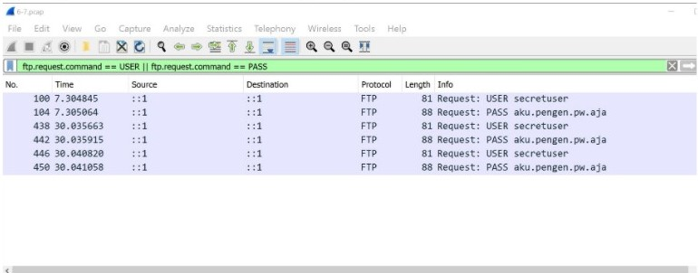
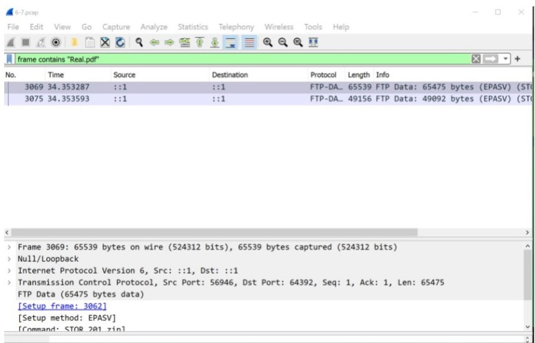
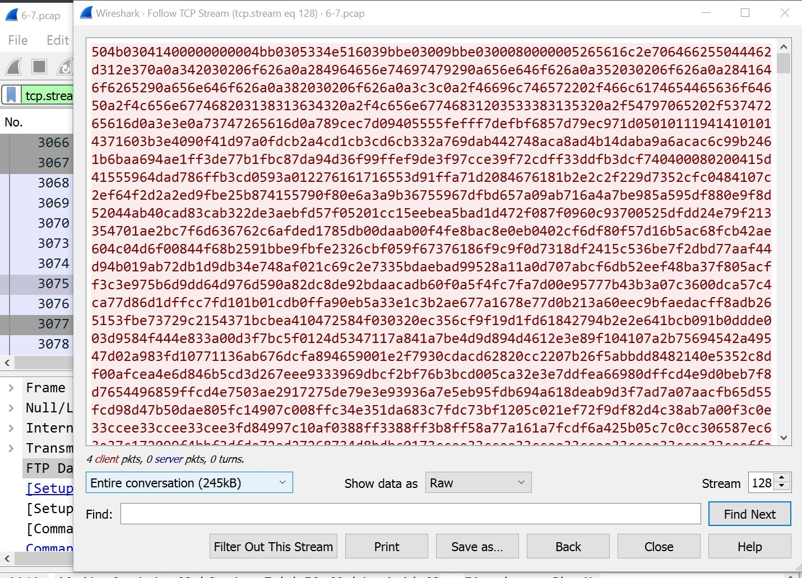
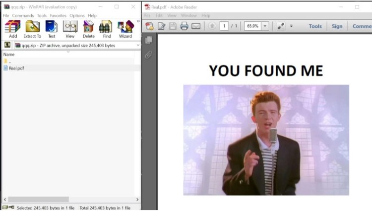
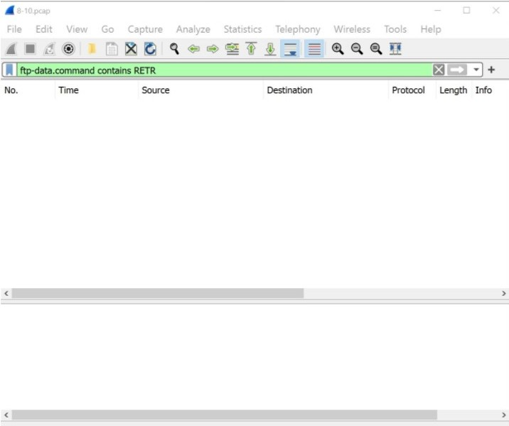
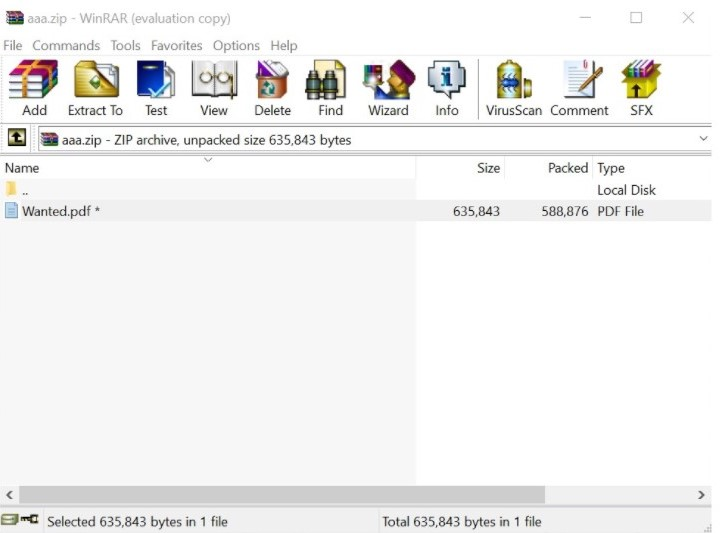
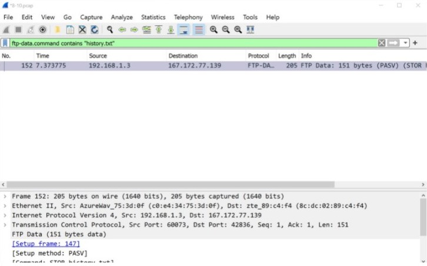
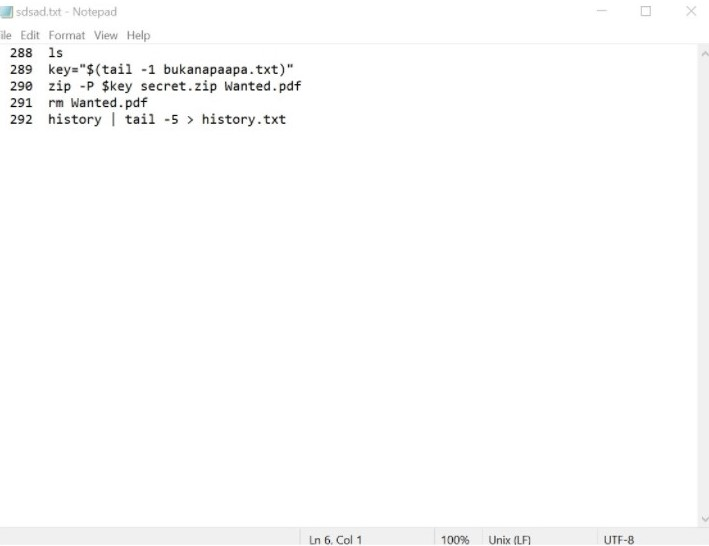
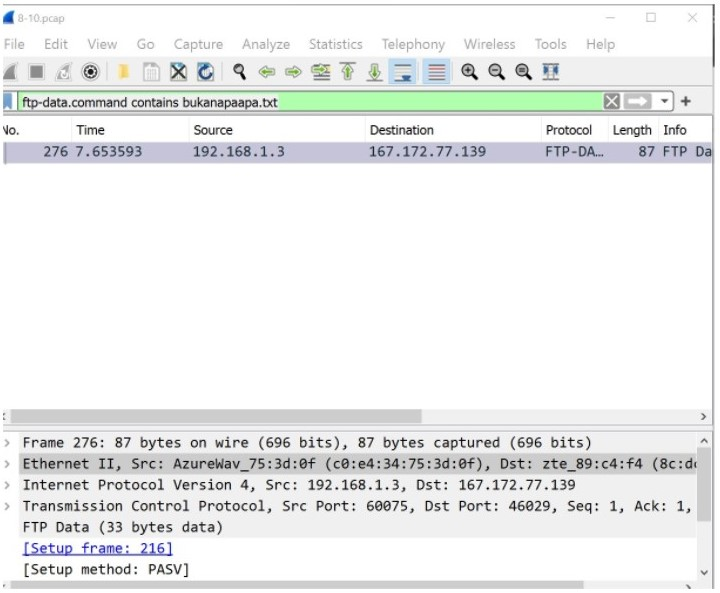
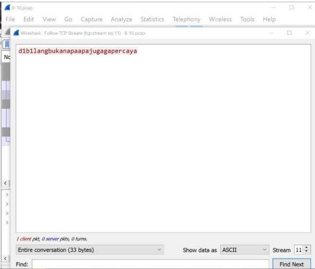

# Jarkom-Modul-1-C03-2021

- Junaedi Akbar 05111940000041
- Zydhan Linnar Putra 05111940000118
- M.Fajri Davyza Chaniago 05111940000180

## 1

> Sebutkan webserver yang digunakan pada "ichimarumaru.tech"!

## 2

> Temukan paket dari web-web yang menggunakan basic authentication method!

## 3

> Ikuti perintah di basic.ichimarumaru.tech! Username dan password bisa didapatkan dari file .pcapng!

## 4

> Temukan paket mysql yang mengandung perintah query select!

## 5

> Login ke portal.ichimarumaru.tech kemudian ikuti perintahnya! Username dan password bisa didapat dari query insert pada table users dari file .pcap!

## 6

> Cari username dan password ketika melakukan login ke FTP Server!

Menjalankan filter:

```
 ftp.request.command == USER || ftp.request.command == PASS
```

Maka akan diperoleh hasil berikut

<br>

## 7

> Ada 500 file zip yang disimpan ke FTP Server dengan nama 0.zip, 1.zip, 2.zip, ..., 499.zip. Simpan dan Buka file pdf tersebut. (Hint = nama pdf-nya "Real.pdf")

Menjalankan filter:

```
frame contains “Real.pdf”
```

Sehingga diperoleh hasil berikut:

<br>
Selanjutnya _Follow_ -> _TCP Stream_ dan download sebagai RAW

<br>
Berikut adalah file yang diperoleh:

<br>

## 8

> Cari paket yang menunjukan pengambilan file dari FTP tersebut!

Sehingga perlu mencari string RETR (untuk mengambil file)
Menjalankan filter:

```
ftp-data.command contains RETR
```



## 9

> Dari paket-paket yang menuju FTP terdapat inidkasi penyimpanan beberapa file. Salah satunya adalah sebuah file berisi data rahasia dengan nama "secret.zip". Simpan dan buka file tersebut!

Menjalankan filter:

```
ftp-data.command contains "secret.zip"
```


Diperoleh file `wanted.pdf` di dalam `secret.zip` namun masih memerlukan password untuk membukanya.

## 10

> Selain itu terdapat "history.txt" yang kemungkinan berisi history bash server tersebut! Gunakan isi dari "history.txt" untuk menemukan password untuk membuka file rahasia yang ada di "secret.zip"!

Menjalankan filter:

```
ftp-data.command contains "history.txt"
```

Untuk mencari file `history.txt`
<br>
Diperoleh:

Selanjutnya follow TCP Stream, diperoleh

ditemukan `key = "$(tail -1 bukanapaapa.txt)`
<br>
sehingga perlu mencari file **bukanapaapa.txt**, dengan filter:

```
ftp-data.command contains "bukanapaapa.txt"
```

Sehingga diperoleh:

diperoleh password : `d1b1langbukanapaapajugagapercaya`
<br>
Selanjutnya buka file `wanted.pdf` pada `secret.zip`


## 11

> Filter sehingga wireshark hanya mengambil paket yang berasal dari port 80!

## 12

> Filter sehingga wireshark hanya mengambil paket yang mengandung port 21!

## 13

> Filter sehingga wireshark hanya menampilkan paket yang menuju port 443!

## 14

> Filter sehingga wireshark hanya mengambil paket yang tujuannya ke kemenag.go.id!

## 15

> Filter sehingga wireshark hanya mengambil paket yang berasal dari ip kalian!
